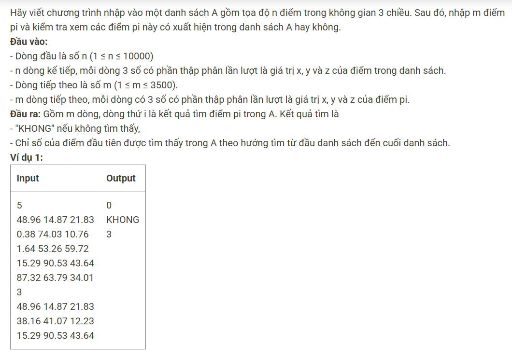

``` c++
#include <bits/stdc++.h>
using namespace std; 

const int N = 10005;
struct khonggian {
    double x, y, z; 
} a[N];

int n, m; 

int main() {
    cin >> n; 
    for (int i = 0; i < n; i++) cin >> a[i].x >> a[i].y >> a[i].z; 
    cin >> m; 
    while (m--) {
        khonggian b; 
        cin >> b.x >> b.y >> b.z; 
        bool flag = 0; 
        for (int i = 0; i < n; i++) 
            if (b.x == a[i].x && b.y == a[i].y && b.z == a[i].z) {
                cout << i << '\n'; 
                flag = 1; 
                break;  
            }
        if (flag) continue; 
        else cout << "KHONG\n"; 
    }
}
```