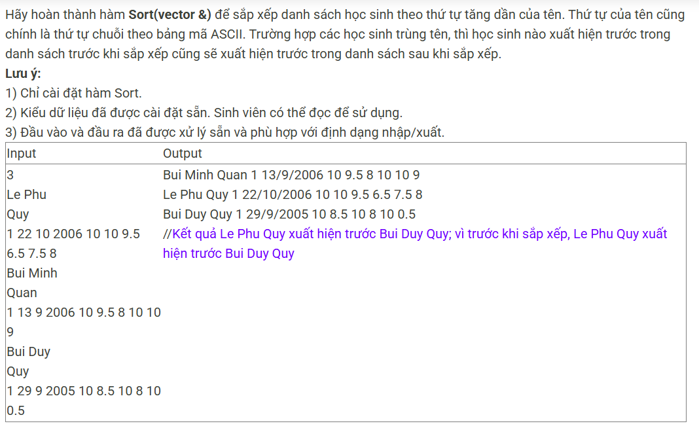

``` c++ 
/// template
#include <iostream>
#include <vector>

using namespace std;

struct Hocsinh{
    string Hodem, Ten;
    bool Gioitinh;
    int Ngay, Thang, Nam;
    double Toan, Van, Ly, Hoa, Anh, Sinh;
};

void InputElement(Hocsinh &x) {
    getline(cin>>ws, x.Hodem);
    getline(cin>>ws, x.Ten);
    cin >> x.Gioitinh;
    cin >> x.Ngay >> x.Thang >> x.Nam;
    cin >> x.Toan >> x.Van >> x.Ly >> x.Hoa >> x.Anh >> x.Sinh;
}

void OutputElement(Hocsinh hs) {
    cout << hs.Hodem
            << ' ' << hs.Ten
            << '\t' << hs.Gioitinh
            << '\t' << hs.Ngay
            << '/' << hs.Thang
            << '/' << hs.Nam
            << '\t' << hs.Toan
            << '\t' << hs.Van
            << '\t' << hs.Ly
            << '\t' << hs.Hoa
            << '\t' << hs.Anh
            << '\t' << hs.Sinh << endl;;
}

void Output(vector<Hocsinh> ls) {
    for (int i = 0; i < ls.size(); i++) {
        OutputElement(ls[i]);
    }
}

void Input(vector<Hocsinh> &ls) {
    int n;
    cin >> n;
    Hocsinh hs;
    for (int i = 0; i < n; i++) {
        InputElement(hs);
        ls.push_back(hs);
    }
}

void Sort(vector<Hocsinh> &ls);

int main()
{
    vector<Hocsinh> ls;
    Input(ls);
    Sort(ls);
    Output(ls);
    return 0;
}

/// code 
void Sort(vector<Hocsinh> &ls) {
    for (int i = 1; i < (int)ls.size(); i++) {
        Hocsinh x = ls[i]; 
        int k = i - 1; 
        while (k >= 0 && x.Ten < ls[k].Ten) {
            ls[k + 1] = ls[k]; 
            k--; 
        } 
        ls[k + 1] = x; 
    }
}
```