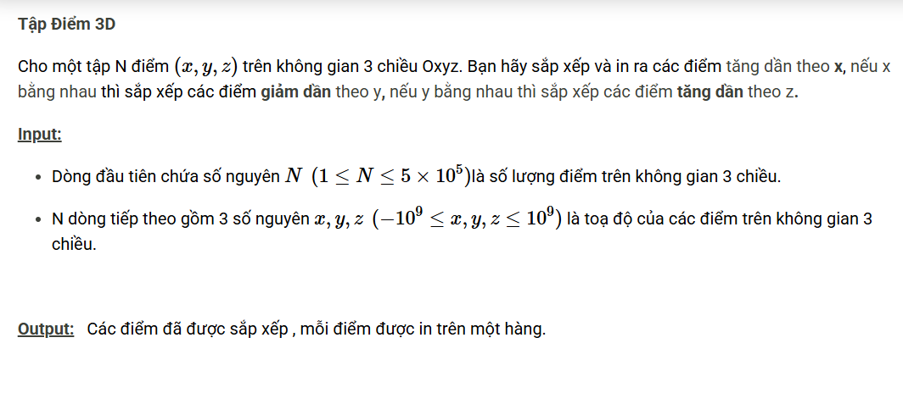

``` c++ 
#include <bits/stdc++.h>
using namespace std;

const int N = 1e6 + 5;
int n;
vector <tuple <int, int, int>> a;

int cmp(tuple <int, int, int> x, tuple <int, int, int> y) {
    if (get<0>(x) < get<0>(y)) return -1;
    if (get<0>(x) > get<0>(y)) return 1;
    if (get<1>(x) > get<1>(y)) return -1;
    if (get<1>(x) < get<1>(y)) return 1;
    if (get<2>(x) < get<2>(y)) return -1;
    if (get<2>(x) > get<2>(y)) return 1;
    return 0;
}

void mergeSort(vector <tuple <int, int, int>> &ls, int size) {
    if (size <= 1) return;
    vector <tuple <int, int, int> > a, b;
    int i = 0, j = size / 2;
    while (i < j) a.push_back(ls[i]), i++;
    while (j < size) b.push_back(ls[j]), j++;
    mergeSort(a, (int)a.size());
    mergeSort(b, (int)b.size());
    int ind_a = 0, ind_b = 0;
    ls.clear();
    while (ind_a < (int)a.size() && ind_b < (int)b.size()) {
        if (cmp(a[ind_a], b[ind_b]) != 1) ls.push_back(a[ind_a]), ind_a++;
        else ls.push_back(b[ind_b]), ind_b++;
    }
    while (ind_a < (int)a.size()) ls.push_back(a[ind_a]), ind_a++;
    while (ind_b < (int)b.size()) ls.push_back(b[ind_b]), ind_b++;
}

int main() {
    cin >> n;
    for (int i = 0; i < n; i++) {
        int x, y, z;
        cin >> x >> y >> z;
        a.push_back({x, y, z});
    }
    mergeSort(a, (int)a.size());
    for (int i = 0; i < n; i++)
        cout << get<0>(a[i]) << ' ' << get<1>(a[i]) << ' ' << get<2>(a[i]) << '\n';
}

/*
8
1 2 1
1 3 2
2 4 3
2 4 1
4 1 -1
0 1 -1
0 0 0
4 1 2
*/
```