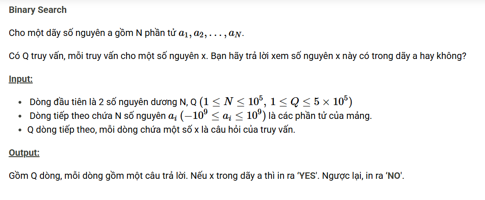

``` c++ 
#include <bits/stdc++.h>
using namespace std; 

const int N = 1e5 + 5; 
int n, q, x, a[N];

bool binary(int l, int r, int x) {
    int mid; 
    while (l <= r) {
        mid = (l + r) >> 1; 
        if (a[mid] == x) return 1; 
        if (a[mid] < x) l = mid + 1; 
        else r = mid - 1; 
    }
    return 0; 
}

int main() {
    cin >> n >> q; 
    for (int i = 0; i < n; i++) cin >> a[i]; 
    sort(a, a + n); 
    while (q--) {
        cin >> x; 
        if (binary(0, n, x)) cout << "YES"; 
        else cout << "NO"; 
        cout << '\n'; 
    }
}
```