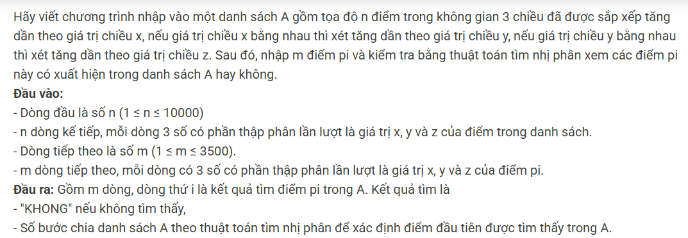

``` c++ 
#include <bits/stdc++.h>
using namespace std;

const int N = 1e6 + 5;
int n, m;
tuple <double, double, double> tmp;
vector <tuple <double, double, double>> a;

int cmp(tuple <double, double, double> x, tuple <double, double, double> y) {
    if (get<0>(x) < get<0>(y)) return -1;
    if (get<0>(x) > get<0>(y)) return 1;
    if (get<1>(x) < get<1>(y)) return -1;
    if (get<1>(x) > get<1>(y)) return 1;
    if (get<2>(x) < get<2>(y)) return -1;
    if (get<2>(x) > get<2>(y)) return 1;
    return 0;
}

void mergeSort(vector <tuple <double, double, double>> &ls, int size) {
    if (size <= 1) return;
    vector <tuple <double, double, double> > a, b;
    int i = 0, j = size / 2;
    while (i < j) a.push_back(ls[i]), i++;
    while (j < size) b.push_back(ls[j]), j++;
    mergeSort(a, (int)a.size());
    mergeSort(b, (int)b.size());
    int ind_a = 0, ind_b = 0;
    ls.clear();
    while (ind_a < (int)a.size() && ind_b < (int)b.size()) {
        if (cmp(a[ind_a], b[ind_b]) != 1) ls.push_back(a[ind_a]), ind_a++;
        else ls.push_back(b[ind_b]), ind_b++;
    }
    while (ind_a < (int)a.size()) ls.push_back(a[ind_a]), ind_a++;
    while (ind_b < (int)b.size()) ls.push_back(b[ind_b]), ind_b++;
}

int binary(tuple <double, double, double> x) {
    int l = 0, r = n - 1, mid, cnt = 0;
    while (l <= r) {
        mid = (l + r) >> 1;
        cnt++;
        if (cmp(a[mid], x) == 0) return cnt;
        if (cmp(a[mid], x) == -1) l = mid + 1;
        else r = mid - 1;
    }
    return -1;
}

int main() {
    cin >> n;
    for (int i = 0; i < n; i++) {
        double x, y, z;
        cin >> x >> y >> z;
        a.push_back({x, y, z});
    }
    mergeSort(a, (int)a.size());
    cin >> m;
    while (m--) {
        cin >> get<0>(tmp) >> get<1>(tmp) >> get<2>(tmp);
        int res = binary(tmp);
        if (res != -1) cout << res;
        else cout << "KHONG";
        cout << '\n';
    }
}

/*
10
0.15 250.43 68.84
0.30 877.52 475.43
0.38 74.03 10.76
0.44 917.67 581.86
0.45 247.91 622.21
0.51 791.87 512.71
0.53 985.68 37.67
0.57 712.08 851.15
0.61 93.00 359.11
0.68 34.72 303.47
4
0.51 791.87 512.71
0.68 34.72 303.47
0.48 74.03 10.76
0.51 791.87 502.71
*/
```