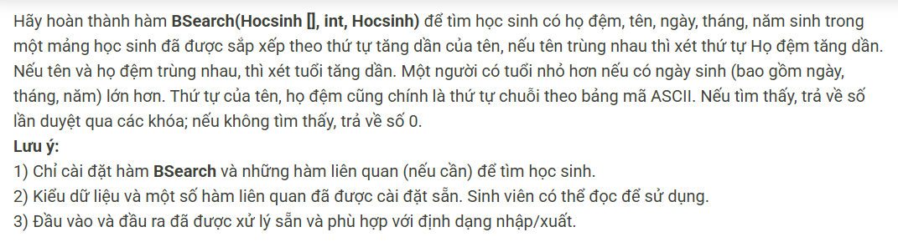

``` c++ 
#include <bits/stdc++.h>
using namespace std;

struct Hocsinh {
    string Hodem; // họ và đệm (có thể chứa khoảng trắng)
    string Ten;   // tên (giả sử không chứa khoảng trắng)
    int Nam;
    int Thang;
    int Ngay;
};


// * code 
int cmp(Hocsinh x, Hocsinh y) {
    if (x.Ten < y.Ten) return -1; 
    if (x.Ten > y.Ten) return 1; 
    if (x.Hodem < y.Hodem) return -1; 
    if (x.Hodem > y.Hodem) return 1; 
    if (x.Nam > y.Nam) return -1;
    if (x.Nam < y.Nam) return 1; 
    if (x.Thang > y.Thang) return -1; 
    if (x.Thang < y.Thang) return 1; 
    if (x.Ngay > y.Ngay) return -1; 
    if (x.Ngay < y.Ngay) return 1;
    return 0; 
}

int BSearch(Hocsinh ds[], int n, Hocsinh tmp) {
    int l = 0, r = n - 1, mid, cnt = 0; 
    while (l <= r) {
        mid = (l + r) >> 1; 
        cnt++; 
        if (cmp(ds[mid], tmp) == 0) return cnt; 
        if (cmp(ds[mid], tmp) == -1) l = mid + 1; 
        else r = mid - 1; 
    }
    return 0; 
}
// * end code 

// wrapper comparator for std::sort using cmp
bool cmp_for_sort(const Hocsinh &a, const Hocsinh &b) {
    return cmp(const_cast<Hocsinh&>(const_cast<Hocsinh&>(const_cast<Hocsinh&>(const_cast<Hocsinh&>(const_cast<Hocsinh&>(const_cast<Hocsinh&>(const_cast<Hocsinh&>(const_cast<Hocsinh&>(const_cast<Hocsinh&>(const_cast<Hocsinh&>(const_cast<Hocsinh&>(const_cast<Hocsinh&>(const_cast<Hocsinh&>(const_cast<Hocsinh&>(const_cast<Hocsinh&>(const_cast<Hocsinh&>(const_cast<Hocsinh&>(a))))))))))))))))),
               const_cast<Hocsinh&>(const_cast<Hocsinh&>(const_cast<Hocsinh&>(const_cast<Hocsinh&>(const_cast<Hocsinh&>(const_cast<Hocsinh&>(const_cast<Hocsinh&>(const_cast<Hocsinh&>(const_cast<Hocsinh&>(const_cast<Hocsinh&>(const_cast<Hocsinh&>(const_cast<Hocsinh&>(const_cast<Hocsinh&>(const_cast<Hocsinh&>(const_cast<Hocsinh&>(const_cast<Hocsinh&>(const_cast<Hocsinh&>(b)))))))))))))))))) < 0;
}

// Lưu ý: do hàm cmp trong file gốc nhận tham trị (không const ref),
// ta dùng cast trên để tránh duplicate code và giữ nguyên cmp như yêu cầu.
// (Cách này hơi 'xấu' nhưng đảm bảo đoạn bạn cung cấp không đổi.)
// Nếu muốn có cách sạch hơn, có thể chỉnh cmp để nhận const Hocsinh&.

// Hàm phụ: tách tên (dòng) thành Hodem và Ten
void splitName(const string &line, string &Hodem, string &Ten) {
    istringstream iss(line);
    vector<string> tokens;
    string w;
    while (iss >> w) tokens.push_back(w);
    if (tokens.empty()) {
        Hodem = "";
        Ten = "";
        return;
    }
    Ten = tokens.back();
    Hodem.clear();
    for (size_t i = 0; i + 1 < tokens.size(); ++i) {
        if (i) Hodem += " ";
        Hodem += tokens[i];
    }
}

int main() {
    ios::sync_with_stdio(false);
    cin.tie(nullptr);

    // Định dạng input (đơn giản):
    // Dòng 1: n (số học sinh)
    // Với mỗi học sinh:
    //   Dòng tên đầy đủ (họ + đệm + tên). Hàm sẽ tách token cuối làm Ten, phần còn lại là Hodem.
    //   Dòng sau: Nam Thang Ngay (3 số nguyên; ví dụ: 2005 12 31)
    //
    // Sau danh sách, nhập 1 học sinh cần tìm theo cùng định dạng:
    //   Dòng tên đầy đủ
    //   Dòng Nam Thang Ngay
    //
    // Output: in ra số lần so sánh khi tìm (giá trị trả về của BSearch),
    //         hoặc 0 nếu không tìm thấy.

    string line;
    // đọc n
    if (!getline(cin, line)) return 0;
    while (!line.empty() && isspace((unsigned char)line.back())) line.pop_back();
    if (line.empty()) return 0;
    int n = stoi(line);

    vector<Hocsinh> ds;
    ds.reserve(n);
    for (int i = 0; i < n; ++i) {
        string fullname;
        // đọc tên (bỏ qua các dòng rỗng)
        do {
            if (!getline(cin, fullname)) fullname = "";
        } while (fullname.size() == 0 && !cin.eof());
        string Hodem, Ten;
        splitName(fullname, Hodem, Ten);

        // đọc ngày sinh
        string dataline;
        do {
            if (!getline(cin, dataline)) dataline = "";
        } while (dataline.size() == 0 && !cin.eof());
        istringstream iss(dataline);
        int Nam=0, Thang=0, Ngay=0;
        iss >> Nam >> Thang >> Ngay;

        Hocsinh hs;
        hs.Hodem = Hodem;
        hs.Ten = Ten;
        hs.Nam = Nam;
        hs.Thang = Thang;
        hs.Ngay = Ngay;
        ds.push_back(hs);
    }

    // sắp xếp theo cmp
    sort(ds.begin(), ds.end(), [](const Hocsinh &a, const Hocsinh &b) {
        // cmp nhận tham trị, nên gọi trực tiếp
        return cmp(a, b) < 0;
    });

    // đọc học sinh cần tìm
    string fullname;
    do {
        if (!getline(cin, fullname)) fullname = "";
    } while (fullname.size() == 0 && !cin.eof());
    string HodemT, TenT;
    splitName(fullname, HodemT, TenT);

    string dataline;
    do {
        if (!getline(cin, dataline)) dataline = "";
    } while (dataline.size() == 0 && !cin.eof());
    istringstream iss2(dataline);
    int NamT=0, ThangT=0, NgayT=0;
    iss2 >> NamT >> ThangT >> NgayT;

    Hocsinh tmp;
    tmp.Hodem = HodemT;
    tmp.Ten = TenT;
    tmp.Nam = NamT;
    tmp.Thang = ThangT;
    tmp.Ngay = NgayT;

    int cnt = BSearch(ds.data(), n, tmp);
    cout << cnt << '\n';
    return 0;
}
```