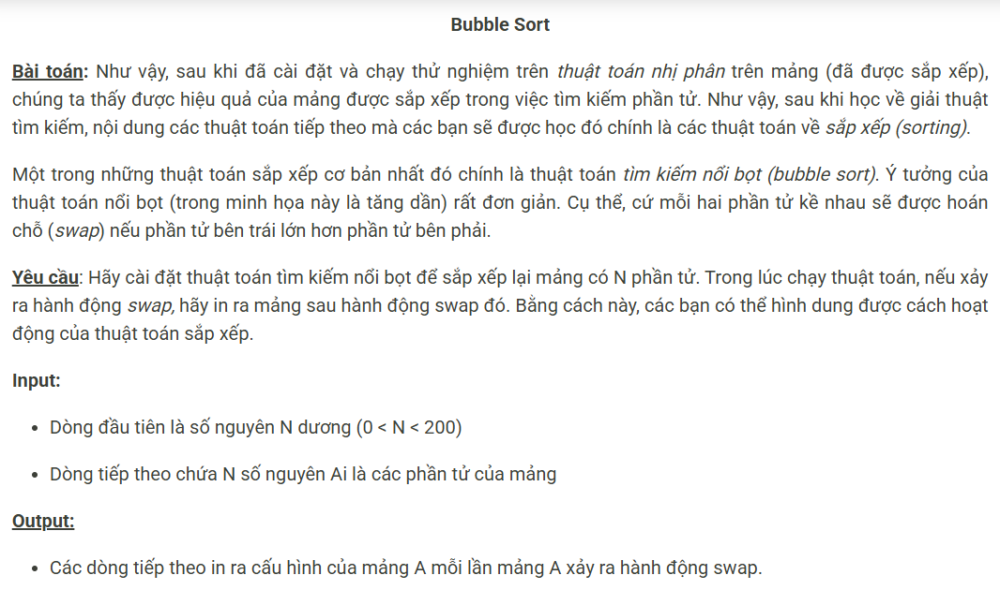

``` c++
#include <bits/stdc++.h>
using namespace std;

const int N = 205;
int n, a[N];

int main() {
    cin >> n;
    for (int i = 0; i < n; i++) cin >> a[i];
    for (int i = 0; i < n; i++) {
        for (int j = 1; j < n - i; j++)
            if (a[j - 1] > a[j]) {
                swap(a[j - 1], a[j]);
                for (int j = 0; j < n; j++) cout << a[j] << ' ';
                cout << '\n';
            }
    }
}
```