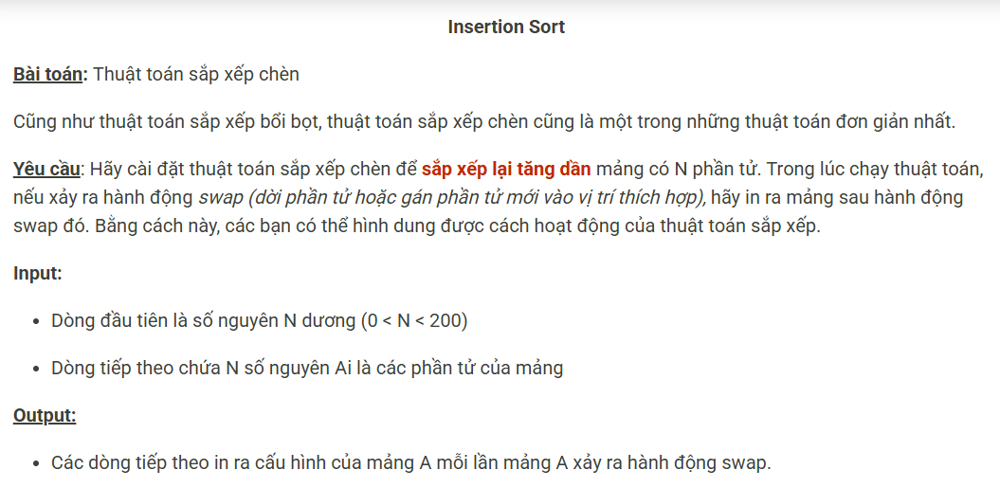

``` c++ 
#include <bits/stdc++.h>
using namespace std;

const int N = 205;
int n, a[N];

int main() {
    cin >> n;
    for (int i = 0; i < n; i++) cin >> a[i];
    for (int i = 1; i < n; i++) {
        int e = a[i], k = i - 1;
        while (k >= 0 && e < a[k]) {
            a[k + 1] = a[k];
            k--;
            for (int j = 0; j < n; j++) cout << a[j] << ' ';
            cout << '\n';
        }
        a[k + 1] = e;
        for (int j = 0; j < n; j++) cout << a[j] << ' ';
        cout << '\n';
    }
}
```