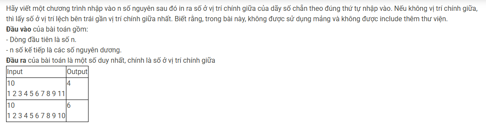

``` c++ 
struct Node {
    int data; 
    Node* pNext; 
};

struct List {
    Node* pHead; 
}; 

void CreateEmptyList(List &l) {
    l.pHead = NULL; 
}

Node* CreateNode(int x) {
    Node* p = new Node; 
    if (p == NULL) exit(0); 
    p->data = x; 
    p->pNext = NULL; 
    return p; 
}

void AddTail(List &l, Node* newNode) {
    if (l.pHead == NULL) l.pHead = newNode; 
    else {
        Node* p = l.pHead; 
        while (p->pNext != NULL) {
            p = p->pNext; 
        }
        p->pNext = newNode; 
    }
}

int n, x, cnt; 
List l; 

int main() {
    cin >> n; 
    CreateEmptyList(l);
    while (n--) {
        cin >> x;
        if (!(x & 1)) {
            cnt++; 
            AddTail(l, CreateNode(x));
        }
    }
    if (cnt & 1) cnt++; 
    cnt /= 2; 
    x = 1; 
    Node* cur = l.pHead;
    while (cur != NULL) { 
        cur = cur->pNext; 
        x++; 
        if (x == cnt) break; 
    }
    cout << cur->data; 
}
```