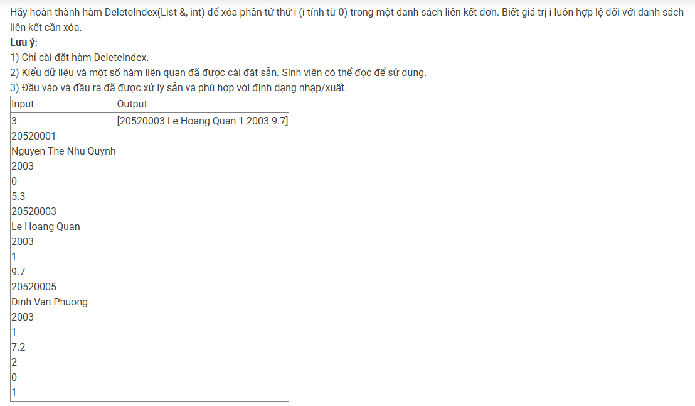

``` c++ 
    if (l.head == NULL || i < 0) return;

    if (i == 0) {
        Node *p = l.head;
        l.head = l.head->next;
        delete p;
        if (l.head == NULL) l.tail = NULL;
        return;
    }

    Node *current = l.head;
    Node *previous = NULL;
    int count = 0;

    while (current != NULL && count < i) {
        previous = current;
        current = current->next;
        count++;
    }

    if (current == NULL) return;

    previous->next = current->next;
    if (current == l.tail) {
        l.tail = previous;
    }
    delete current;
``` 