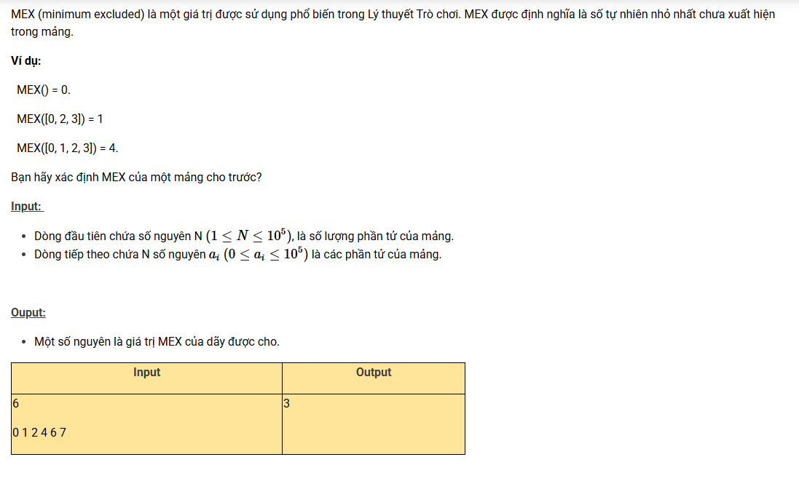

``` c++ 
#include <bits/stdc++.h>
using namespace std; 

const int N = 1e5 + 5; 
int n, x, a[N], b[N]; 

int main() {
    cin >> n; 
    for (int i = 0; i < n; i++) {
        cin >> x;
        if (x < N) a[x]++; 
    }
    for (int i = 0; i < N; i++)
        if (!a[i]) return !(cout << i); 
    cout << n; 
}
```