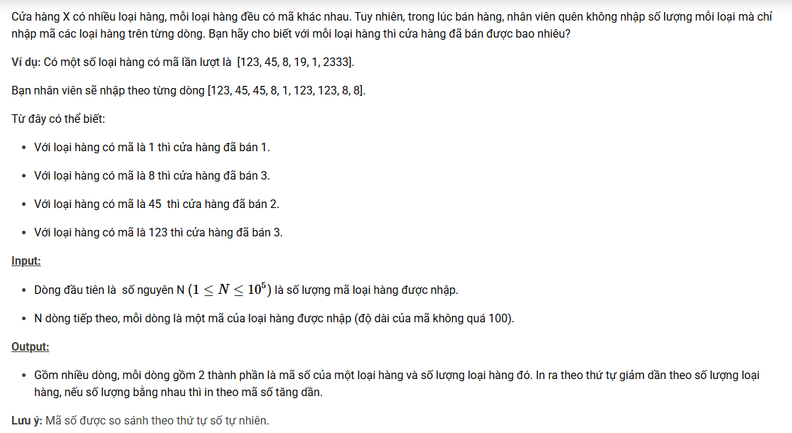

``` c++
#include <bits/stdc++.h>
using namespace std; 

const int N = 1e5 + 5; 
int n, cnt; 
string x; 
vector <string> a;
vector <pair <string, int> > res; 

int cmp1(const string &x, const string &y) {
    if ((int)x.size() < (int)y.size()) return -1; 
    if ((int)x.size() > (int)y.size()) return 1;
    if (x < y) return -1; 
    if (x > y) return 1;
    return 0; 
}

void mergeSort1(vector<string> &a) {
    if (a.size() <= 1) return;
    int mid = a.size() / 2;
    vector<string> left(a.begin(), a.begin() + mid);
    vector<string> right(a.begin() + mid, a.end());
    mergeSort1(left);
    mergeSort1(right);
    a.clear();
    int i = 0, j = 0;
    while (i < left.size() && j < right.size()) {
        if (cmp1(left[i], right[j]) < 0) a.push_back(left[i++]);
        else a.push_back(right[j++]);
    }
    while (i < left.size()) a.push_back(left[i++]);
    while (j < right.size()) a.push_back(right[j++]);
}

int cmp2(const pair <string, int> &x, const pair <string, int> &y) {
    if (x.second > y.second) return -1;
    if (x.second < y.second) return 1;
    return cmp1(x.first, y.first);
}

void mergeSort2(vector<pair<string, int>> &a) {
    if (a.size() <= 1) return;
    int mid = a.size() / 2;
    vector<pair<string, int>> left(a.begin(), a.begin() + mid);
    vector<pair<string, int>> right(a.begin() + mid, a.end());
    mergeSort2(left);
    mergeSort2(right);
    a.clear();
    int i = 0, j = 0;
    while (i < left.size() && j < right.size()) {
        if (cmp2(left[i], right[j]) < 0) a.push_back(left[i++]);
        else a.push_back(right[j++]);
    }
    while (i < left.size()) a.push_back(left[i++]);
    while (j < right.size()) a.push_back(right[j++]);
}

int main() {
    cin >> n; 
    for (int i = 0; i < n; i++) {
        cin >> x;
        a.push_back(x); 
    }
    mergeSort1(a); 
    for (int i = 0; i < (int)a.size(); i++) {
        if (i == 0 || a[i] != a[i - 1]) res.push_back({a[i], 1}); 
        else res.back().second++; 
    }
    mergeSort2(res); 
    for (int i = 0; i < (int)res.size(); i++)  
        cout << res[i].first << ' ' << res[i].second << '\n';
}
```