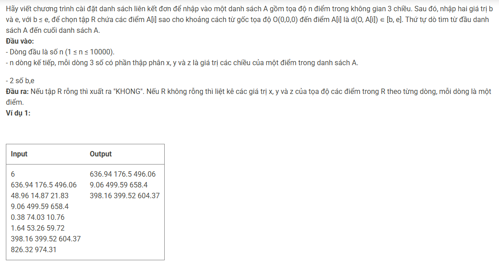

``` c++
struct Data {
    double x, y, z; 
};

struct Node {
    Data point; 
    Node* pNext; 
}; 

struct List {
    Node* head;
}; 

void CreateEmptyList(List &l) {
    l.head = NULL; 
}

Node* CreateNode(Data p) {
    Node* newNode = new Node; 
    if (newNode == NULL) exit(0); 
    newNode->point = p; 
    newNode->pNext = NULL; 
    return newNode; 
}

void AddTail(List &l, Node* newNode) {
    if (l.head == NULL) l.head = newNode; 
    else {
        Node* tmp = l.head; 
        while (tmp->pNext != NULL) tmp = tmp->pNext; 
        tmp->pNext = newNode; 
    }
}

int n, cnt; 
double b, e, calc; 
Data tmp; 
List l; 

int main() {
    cin >> n; 
    while (n--) {
        cin >> tmp.x >> tmp.y >> tmp.z; 
        AddTail(l, CreateNode(tmp)); 
    }
    cin >> b >> e; 
    Node* cur = l.head; 
    while (cur != NULL) {
        tmp = cur->point; 
        calc = sqrt((tmp.x * tmp.x) + (tmp.y * tmp.y) + (tmp.z * tmp.z)); 
        if (calc >= b && calc <= e) {
            cnt++; 
            cout << tmp.x << ' ' << tmp.y << ' ' << tmp.z << '\n'; 
        }
        cur = cur->pNext; 
    }
    if (!cnt) cout << "KHONG"; 
}
```