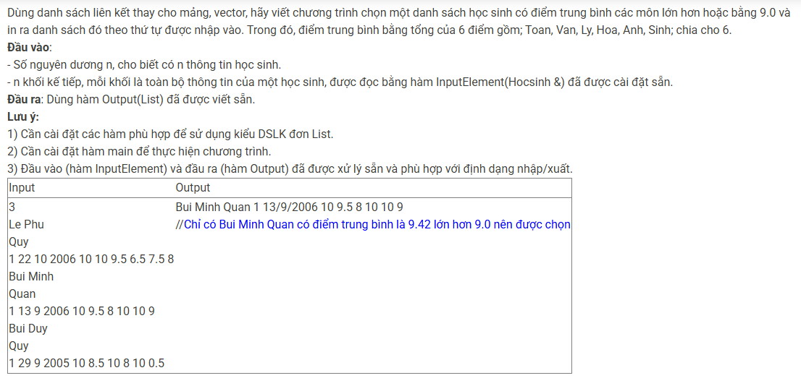

``` c++ 
void CreateEmptyList(List &ds) {
    ds.head = NULL;
    ds.tail = NULL;
}

Node* CreateNode(Hocsinh x) {
    Node* p = new Node; 
    if (p == NULL) exit(1); 
    p->data = x;
    p->next = NULL;
    return p;
}

void AddTail(List &ds, Node* p) {
    if (ds.head == NULL) {
        ds.head = p;
        ds.tail = p;
    } else {
        ds.tail->next = p;
        ds.tail = p;
    }
}

int main() {
    List ds; 
    CreateEmptyList(ds); 
    int n; 
    cin >> n; 
    while (n--) {
        Hocsinh x; 
        InputElement(x); 
        Node* p = CreateNode(x); 
        AddTail(ds, p); 
    }
    List res; 
    CreateEmptyList(res);
    Node* cur = ds.head;
    while (cur != NULL) {
        double dtb = (cur->data.Toan + cur->data.Van + cur->data.Ly + cur->data.Hoa + cur->data.Anh + cur->data.Sinh) / 6.0;
        if (dtb >= 9.0) {
            Node* p = CreateNode(cur->data);
            AddTail(res, p);
        }
        cur = cur->next;
    }
    Output(res);
}
```