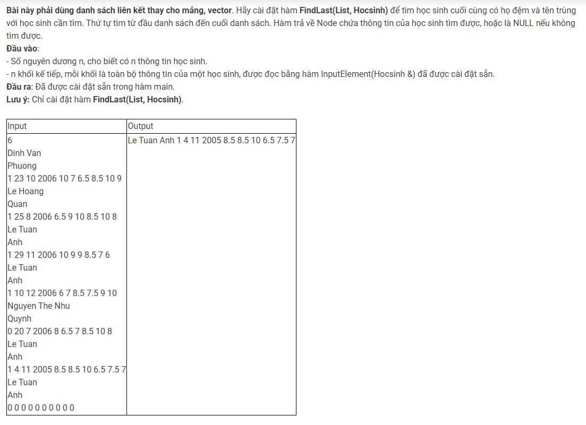

``` c++ 
Node * FindLast(List l, Hocsinh x) {
    Node * p = l.head;
    Node * result = NULL;
    while (p != NULL) {
        if (p->data.Hodem == x.Hodem && p->data.Ten == x.Ten) result = p;
        p = p->next;
    }
    return result;
}
```