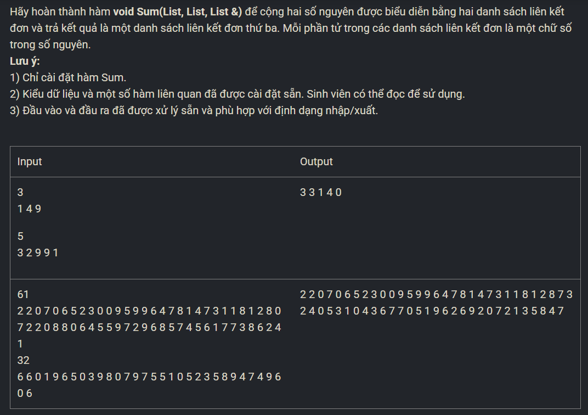

``` c++ 
List rev_a; 
CreateList(rev_a); 
Node* ind_a = a.head; 
while (ind_a != NULL) {
    AddHead(rev_a, ind_a->num); 
    ind_a = ind_a->next; 
}
ind_a = rev_a.head; 

List rev_b; 
CreateList(rev_b); 
Node* ind_b = b.head; 
while (ind_b != NULL) {
    AddHead(rev_b, ind_b->num); 
    ind_b = ind_b->next; 
}
ind_b = rev_b.head; 

bool n = 0; 
while (ind_a != NULL && ind_b != NULL) {
    int s = ind_a->num + ind_b->num + n; 
    if (s > 9) {
        s -= 10; 
        n = 1; 
    }
    else n = 0; 
    AddHead(c, s); 
    ind_a = ind_a->next; 
    ind_b = ind_b->next; 
}
while (ind_a != NULL) {
    int s = ind_a->num + n; 
    if (s > 9) {
        s -= 10; 
        n = 1; 
    }
    else n = 0; 
    AddHead(c, s); 
    ind_a = ind_a->next; 
}
while (ind_b != NULL) {
    int s = ind_b->num + n; 
    if (s > 9) {
        s -= 10; 
        n = 1; 
    }
    else n = 0; 
    AddHead(c, s); 
    ind_b = ind_b->next; 
}
```