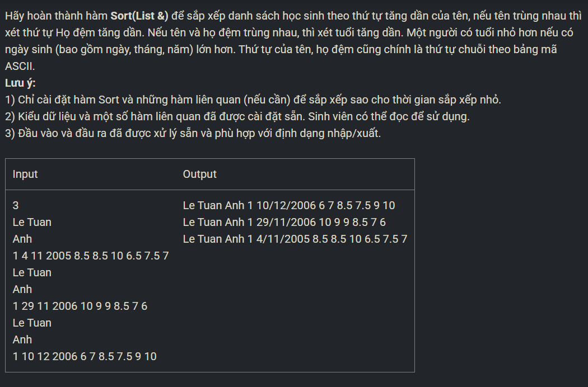

``` c++ 
int cmp(Hocsinh x, Hocsinh y) {
    if (x.Ten < y.Ten) return -1; 
    if (x.Ten > y.Ten) return 1; 
    if (x.Hodem < y.Hodem) return -1; 
    if (x.Hodem > y.Hodem) return 1; 
    if (x.Nam > y.Nam) return -1; 
    if (x.Nam < y.Nam) return 1; 
    if (x.Thang > y.Thang) return -1; 
    if (x.Thang < y.Thang) return 1; 
    if (x.Ngay > y.Ngay) return -1; 
    if (x.Ngay < y.Ngay) return 1;
    return 0; 
}

void Sort(List &l) {
    List a, b; 
    CreateList(a); 
    CreateList(b);
    Node* p = l.head; 
    int size_a = 0, size_b = 0; 
    while (p != NULL) {
        AddTail(a, p->data); 
        size_a++; 
        p = p->next; 
        if (p != NULL) {
            AddTail(b ,p->data); 
            size_b++; 
            p = p->next; 
        }
    }
    if (size_a > 1) Sort(a); 
    if (size_b > 1) Sort(b); 

    while (l.head != NULL) RemoveHead(l); 

    Node* ind_a = a.head; 
    Node* ind_b = b.head; 

    while (ind_a != NULL && ind_b != NULL) {
        if (cmp(ind_a->data, ind_b->data) == -1) {
            AddTail(l, ind_a->data); 
            ind_a = ind_a->next; 
        }
        else {
            AddTail(l, ind_b->data); 
            ind_b = ind_b->next;
        }
    }
    while (ind_a != NULL) {
        AddTail(l, ind_a->data); 
        ind_a = ind_a->next; 
    }
    while (ind_b != NULL) {
        AddTail(l, ind_b->data); 
        ind_b = ind_b->next; 
    }
}
```