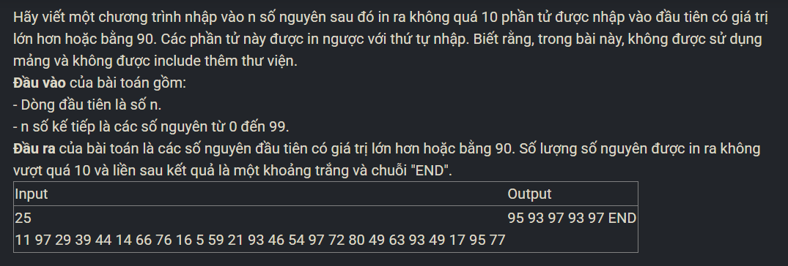

``` c++ 
struct Node {
    int num; 
    Node* next; 
};

struct List {
    Node* head; 
    Node* tail; 
};

Node* CreateNode(int x) {
    Node* p = new Node;
    if (p == NULL) exit(1);
    p->num = x;
    p->next = NULL;
    return p;
}

void CreateList(List &l) {
    l.head = l.tail = NULL;
}

void AddHead(List &l, int x) {
    Node *p = CreateNode(x);
    if (l.head == NULL)
        l.tail = p;
    else
        p->next = l.head;
    l.head = p;
}

void AddTail(List &l, int x) {
    Node *p = CreateNode(x);
    if (l.head == NULL)
        l.head = p;
    else
        l.tail->next = p;
    l.tail = p;
}

int main() {
    int n; 
    cin >> n;
    int k; 
    List l; 
    CreateList(l); 
    for (int i = 0; i < n; i++) {
        cin >> k; 
        AddTail(l, k); 
    }
    int cnt = 0; 
    Node* p = l.head; 
    List res; 
    CreateList(res); 
    while (p != NULL && cnt < 10) {
        if (p->num >= 90) {
            AddHead(res, p->num); 
            cnt++; 
        }
        p = p->next; 
    }
    p = res.head; 
    while (p != NULL) {
        cout << p->num << ' '; 
        p = p->next; 
    }
    cout << "END"; 
}
```