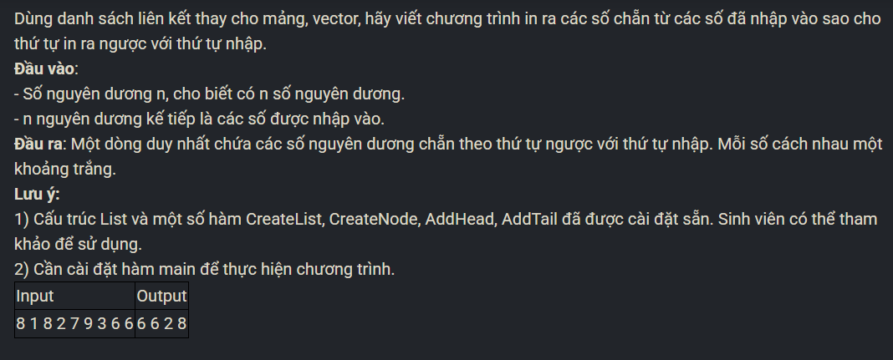

``` c++ 
int main() {
    int n; 
    cin >> n; 
    int k; 
    List l; 
    CreateList(l); 
    for (int i = 0; i < n; i++) {
        cin >> k; 
        if (k & 1) continue; 
        AddHead(l, k); 
    }
    Node* p = l.head; 
    while (p != NULL) {
        cout << p->data << ' ';
        p = p->next; 
    }
}
```