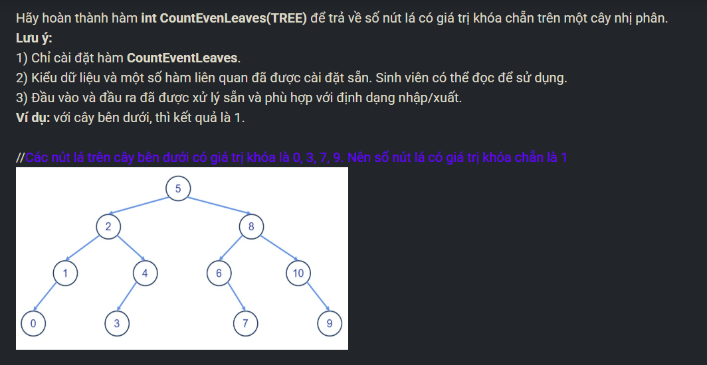

``` c++ 
int CountEvenLeaves(TREE r) {
    if (r == NULL) return 0; 
    int cnt = 0; 
    if (r->left == NULL && r->right == NULL) 
        if (!((r->key) & 1)) cnt++; 
    if (r->left != NULL) cnt += CountEvenLeaves(r->left); 
    if (r->right != NULL) cnt += CountEvenLeaves(r->right); 
    return cnt; 
}
```