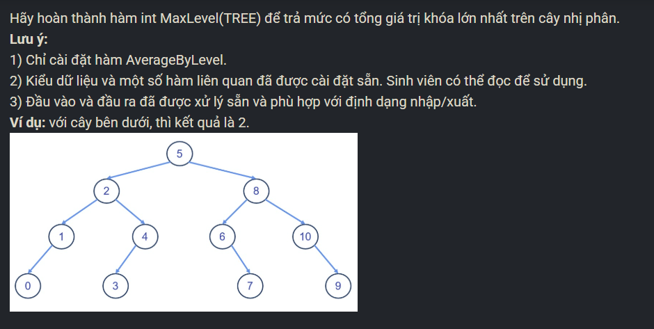

``` c++ 
int MaxLevel(TREE r) {
    vector <TREE> a; 
    a.push_back(r); 
    int level = -1, maxSumKey = 0, maxlevel = 0; 
    while (true) {
        int sumKey = 0; 
        level++; 
        vector <TREE> b; 
        for (int i = 0; i < (int)a.size(); i++) {
            sumKey += a[i]->key; 
            if (a[i]->left != NULL) b.push_back(a[i]->left); 
            if (a[i]->right != NULL) b.push_back(a[i]->right); 
        }
        if (sumKey > maxSumKey) {
            maxSumKey = sumKey; 
            maxlevel = level; 
        }
        if (!(int)b.size()) break; 
        a.clear(); 
        for (int i = 0; i < (int)b.size(); i++) a.push_back(b[i]); 
    }
    return maxlevel; 
}
```