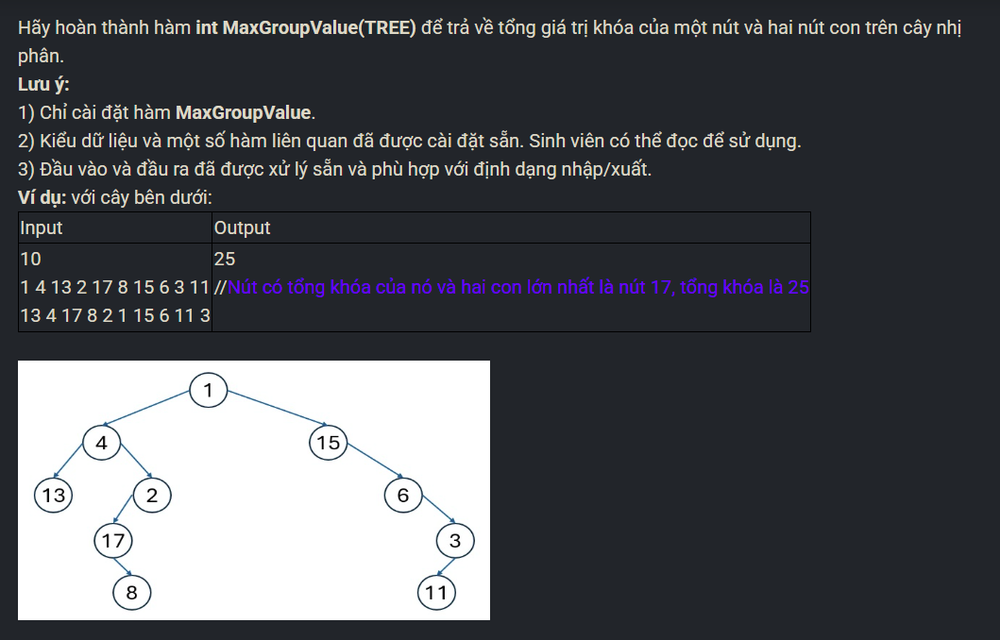

``` c++ 
int MaxGroup(TREE r) {
    if (r == NULL) return 0; 
    int sum = r->key; 
    if (r->left != NULL) sum += r->left->key; 
    if (r->right != NULL) sum += r->right->key; 

    if (r->left != NULL) sum = max(sum, MaxGroup(r->left)); 
    if (r->right != NULL) sum = max(sum, MaxGroup(r->right)); 
    return sum; 
}
```