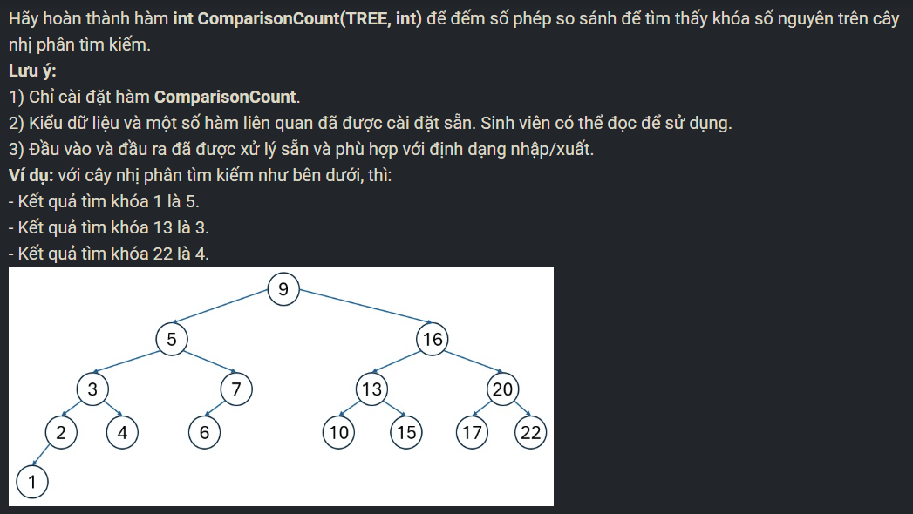

``` c++ 
int ComparisonCount(TREE t, int k) {
    int cnt = 0; 
    while (t != NULL) {
        cnt++; 
        if (t->key == k) break; 
        else if (t->key < k) t = t->right; 
        else if (t->key > k) t = t->left; 
    }
    return cnt; 
}
```