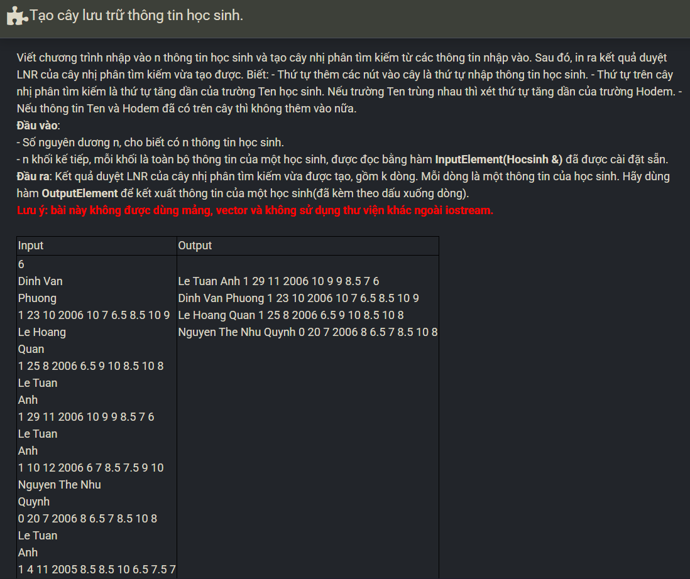

``` c++ 
int compare(Hocsinh x, Hocsinh y) {
    if (x.Ten < y.Ten) return -1; 
    if (x.Ten > y.Ten) return 1; 
    if (x.Hodem < y.Hodem) return -1; 
    if (x.Hodem > y.Hodem) return 1;
    return 0; 
}

void InsertTree(TREE &tree, Hocsinh x) {
    bool c = 0; 
    if (tree == NULL) {
        tree = CreateTNode(x); 
        return; 
    }
    if (compare(tree->data, x) == 1) InsertTree(tree->left, x); 
    else if (compare(tree->data, x) == -1) InsertTree(tree->right, x); 
    else return; 
}

void inorder(TREE tree) {
    if (tree == NULL) return; 
    inorder(tree->left); 
    OutputElement(tree->data); 
    inorder(tree->right); 
}

int main() {
    int n;
    cin >> n; 
    TREE tree; 
    CreateTree(tree); 
    Hocsinh x; 
    while (n--) {
        InputElement(x); 
        InsertTree(tree, x);    
    }
    inorder(tree); 
}
```