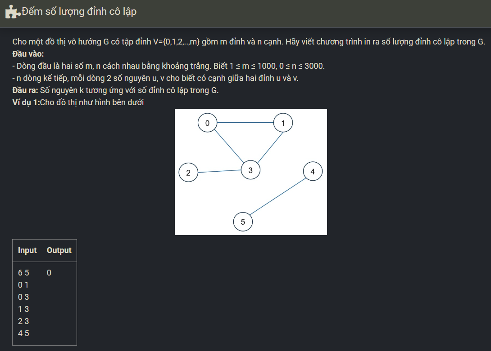

``` c++ 
#include <bits/stdc++.h>
using namespace std; 

int m, n, u, v, cnt; 
vector <int> a[3005]; 

int main() {
    cin >> m >> n; 
    while (n--) {
        cin >> u >> v; 
        a[u].push_back(v); 
        a[v].push_back(u); 
    }
    for (int i = 0; i < m; i++) 
        if (!(int)a[i].size()) cnt++;
    cout << cnt; 
}
```