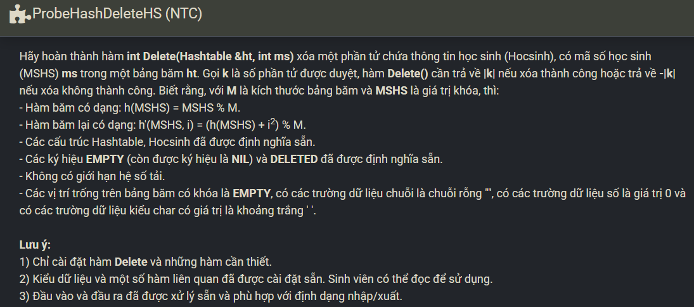

``` c++ 
int Delete(Hashtable &ht, int m) {
    int ind = m % ht.M; 
    int cnt = 0; 
    
    while (cnt < ht.M) {
        if (ht.table[ind].MSHS == m) {
            ht.n--; 
            ht.table[ind].MSHS = DELETED;
            return cnt + 1; 
        }
        
        if (ht.table[ind].MSHS == EMPTY) {
            return -(cnt + 1);
        }
        
        cnt++; 
        ind = (m % ht.M + cnt * cnt) % ht.M; 
    }
    
    return -(cnt); 
}
```