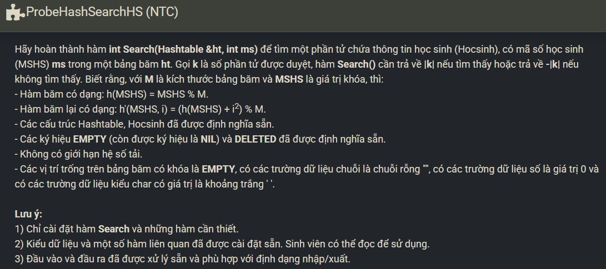

``` c++ 
int Search(Hashtable ht, int m) {
    int ind = m % ht.M; 
    int cnt = 0; 
    
    while (cnt < ht.M) {
        if (ht.table[ind].MSHS == m) return cnt + 1; 
        if (ht.table[ind].MSHS == EMPTY) return -(cnt + 1); 
        cnt++; 
        ind = (m % ht.M + cnt * cnt) % ht.M; 
    }
    
    return -cnt;
}
```