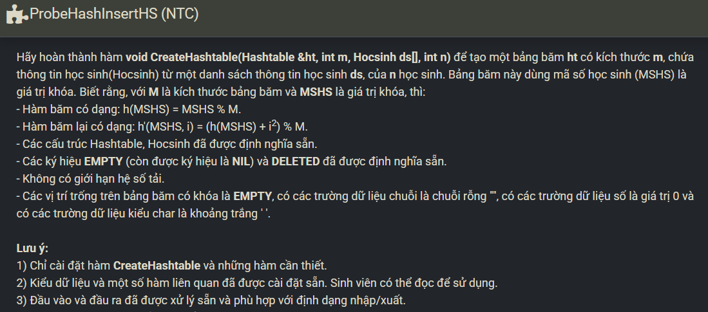

``` c++ 
void CreateHashtable(Hashtable &ht, int m, Hocsinh ds[], int n) {
    ht.M = m; 
    ht.n = 0; 
    
    for (int i = 0; i < m; i++) {
        ht.table[i].MSHS = EMPTY;
        ht.table[i].HoTen = "";
        ht.table[i].Namsinh = 0;
        ht.table[i].Gioitinh = ' ';
        ht.table[i].Toan = 0.0;
        ht.table[i].Ly = 0.0;
        ht.table[i].Hoa = 0.0;
        ht.table[i].Anh = 0.0;
    }
    
    for (int i = 0; i < n; i++) {
        int mshs = ds[i].MSHS;
        int ind = mshs % ht.M;
        int cnt = 0;
        
        while (cnt < ht.M) {
            if (ht.table[ind].MSHS == EMPTY || ht.table[ind].MSHS == DELETED) {
                ht.table[ind] = ds[i];
                ht.n++;
                break;
            }
            cnt++;
            ind = (mshs % ht.M + cnt * cnt) % ht.M;
        }
    }
}
```