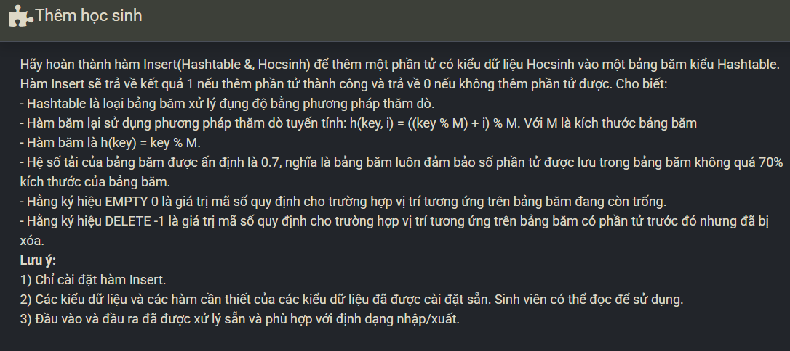

``` c++ 
    if ((double)(ht.n + 1) / ht.M > LOAD) {
        return 0; 
    }
    
    int ind = x.Maso % ht.M; 
    int i = 0;
    
    while (i < ht.M) {
        int pos = (x.Maso % ht.M + i) % ht.M;
        
        if (ht.table[pos].Maso == EMPTY || ht.table[pos].Maso == DELETE) {
            ht.table[pos] = x;
            ht.n++;
            return 1; 
        }
        
        i++;
    }
    
    return 0;
```