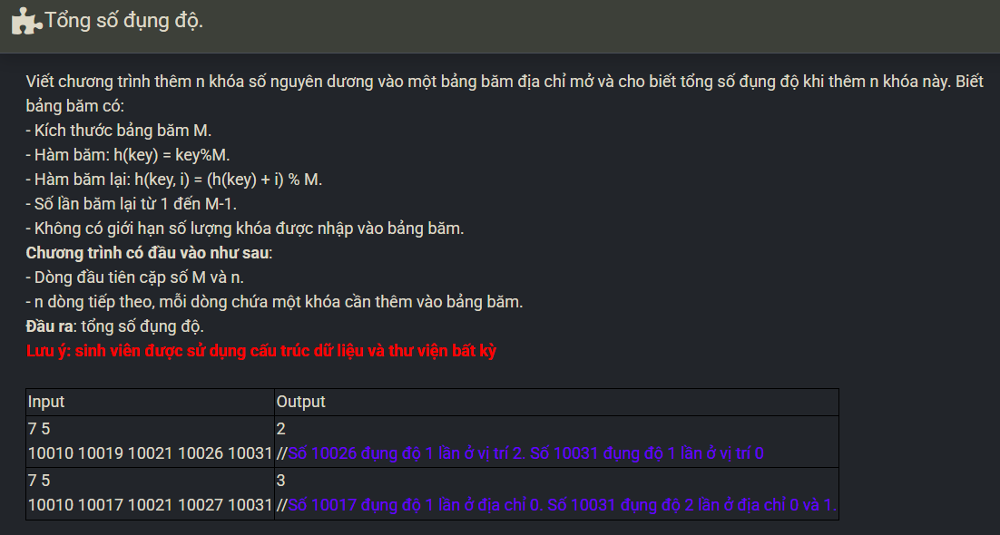

``` c++ 
#include <iostream>


#define MAX 10000
#define EMPTY 0
#define NIL 0
#define DELETED -1

using namespace std;

struct Hashtable {
    int M; // Kich thuoc bang bam
    int n; // so phan tu trong bang bam
    int collision[MAX]; 
    int table[MAX];
};

void InputElement(int &x) {
    cin >> x; 
}

void CreateHashtable(Hashtable &, int, int[], int);

int main()
{
    Hashtable ht;
    int ds[MAX];
    int m, n;

    cin >> m >> n;
    for (int i = 0; i < n; i++) {
        InputElement(ds[i]);
    }

    CreateHashtable(ht, m, ds, n);
    int total_collision = 0; 

    for (int i = 0; i < ht.M; i++) 
        total_collision += ht.collision[i]; 

    cout << total_collision; 
    return 0;
}

void CreateHashtable(Hashtable &ht, int m, int ds[], int n) {
    ht.M = m; 
    ht.n = 0; 
    
    for (int i = 0; i < m; i++) 
        ht.table[i] = 0; 
    
    for (int i = 0; i < n; i++) {
        int key = ds[i];
        int ind = key % ht.M;
        int cnt = 0;
        
        while (cnt < ht.M) {
            if (ht.table[ind] == 0) {
                ht.table[ind] = ds[i];
                ht.n++;
                break;
            }
            cnt++;
            ht.collision[ind]++;
            ind = (key % ht.M + cnt) % ht.M;
        }
    }
}
```