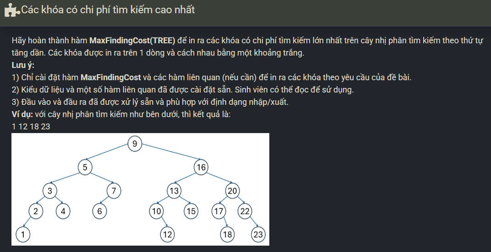

``` c++ 
int maxLevel(TREE tree) {
    if (tree == NULL) return 0; 
    return max(maxLevel(tree->left), maxLevel(tree->right)) + 1; 
}

void traversal(TREE tree, int maxlevel, int level) {
    int total = 0; 
    if (level == maxlevel) {
        cout << tree->key << ' '; 
        return;
    } 
    if (tree->left != NULL) traversal(tree->left, maxlevel, level + 1); 
    if (tree->right != NULL) traversal(tree->right, maxlevel, level + 1); 
}
	
void MaxFindingCost(TREE tree) {
    int maxlevel = maxLevel(tree); 
    traversal(tree, maxlevel, 1); 
}
```