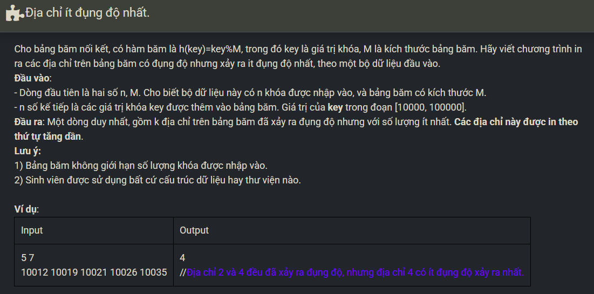

``` c++ 
#include <iostream>
#include <string>

#define LOAD 0.7
using namespace std;

struct Node {
    int key; 
    Node *next;
};

struct List {
    int len; 
    Node * head, *tail;
};

Node * CreateNode(int);
void CreateList(List &);
void AddTail(List&, int);
int RemoveHead(List &);
int RemoveAfter(List &, Node *);
void DeleteList(List &);

struct Hashtable {
    int M; // Kich thuoc bang bam
    int n; // so phan tu trong bang bam
    List *table;
};

void CreateHashtable(Hashtable &, int);
int Hash(Hashtable, int); // Ham bam ma so hoc sinh thanh chi so
Node * Search(Hashtable, int, int&);
void PrintHashtable(Hashtable);
void DeleteHashtable(Hashtable &);

int main()
{
    Hashtable hashtable;

    int m, n, k;

    cin >> n >> m;
    CreateHashtable(hashtable, m);
    for (int i = 0; i < n; i++) {
        cin >> k;
        AddTail(hashtable.table[Hash(hashtable, k)], k);
    }
    int min_collision = m; 
    for (int i = 0; i < m; i++) 
        if (hashtable.table[i].len > 1) 
            min_collision = min(min_collision, hashtable.table[i].len);
    for (int i = 0; i < m; i++) 
        if (hashtable.table[i].len == min_collision) 
            cout << i << ' '; 
    DeleteHashtable(hashtable);
    return 0;
}

void CreateList(List &l) {
    l.len = 0; 
    l.head = l.tail = NULL;
}

Node * CreateNode(int x) {
    Node *p = new Node;
    if (p == NULL)
        exit(1);
    p->next = NULL;
    p->key = x;
    return p;
}

void AddTail(List &l, int x) {
    Node *p = CreateNode(x);
    l.len++; 
    if (l.head == NULL)
        l.head = l.tail = p;
    else {
        l.tail->next = p;
        l.tail = p;
    }
}

void DeleteList(List &l) {
    while (l.head) {
        Node *p = l.head;
        l.head = p->next;
        delete p;
    }
    l.len = 0; 
    l.head = l.tail = NULL;
}

void CreateHashtable(Hashtable &ht, int m) {
    ht.table = new List[m];
    for (int i = 0; i < m; i++)
        CreateList(ht.table[i]);
    ht.M = m;
    ht.n = 0;
}

int Hash(Hashtable ht, int maso) {
    return maso % ht.M;
}

void DeleteHashtable(Hashtable &ht) {
    for (int i = 0; i < ht.M; i++) {
        DeleteList(ht.table[i]);
    }
    delete [] ht.table;
    ht.table = NULL;
    ht.M = 0;
}
```