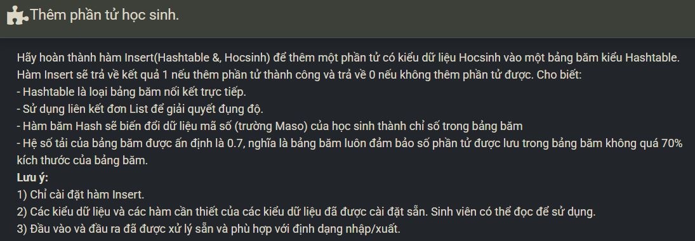

``` c++ 
    double currentLoad = (double)(ht.n + 1) / ht.M;
    if (currentLoad > LOAD) return 0; 
    
    int ind = Hash(ht, x.Maso); 
    AddTail(ht.table[ind], x);
    ht.n++; 
    return 1;
```