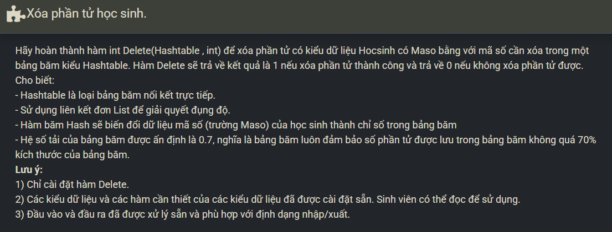

``` c++ 
    int ind = Hash(ht, maso); 
    Node* p = ht.table[ind].head; 
    Node* q = NULL; 
    
    while (p != NULL && p->data.Maso != maso) {
        q = p; 
        p = p->next; 
    }
    if (p == NULL) return 0; 
    if (RemoveAfter(ht.table[ind], q)) {
        ht.n--; 
        return 1;
    }
    return 0;
```